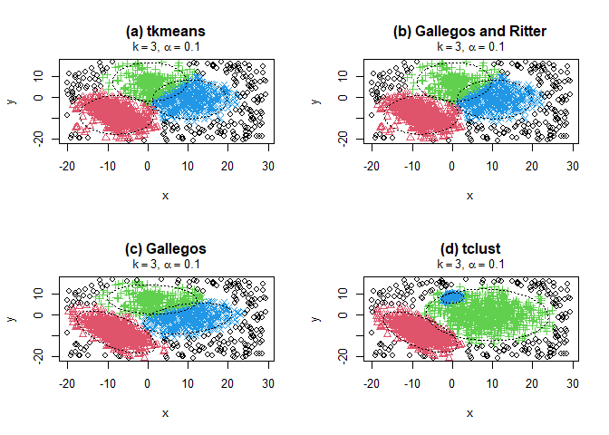

<!-- README.md is generated from README.Rmd. Please edit that file -->

# `tclust`: Robust Trimmed Clustering

<!-- badges: start -->

[](https://cran.r-project.org/package=tclust)
[](https://github.com/valentint/tclust/actions/workflows/R-CMD-check.yaml)
[](https://cran.r-project.org/package=tclust)
[](https://cran.r-project.org/package=tclust)
[](https://www.gnu.org/licenses/gpl-3.0.en.html)

<!-- badges: end -->

The package `tclust` provides functions for robust trimmed clustering.
The methods are described in Garcia-Escudero (2008)
[doi:10.1214/07-AOS515](https://doi:10.1214/07-AOS515), Fritz et
al. (2012)
[doi:10.18637/jss.v047.i12](https://doi:10.18637/jss.v047.i12),
Garcia-Escudero et al. (2011)
[doi:10.1007/s11222-010-9194-z](https://doi:10.1007/s11222-010-9194-z)
and others.

## Installation

The `tclust` package is on CRAN (The Comprehensive R Archive Network)
and the latest release can be easily installed using the command

    install.packages("tclust")
    library(tclust)

## Building from source

To install the latest stable development version from GitHub, you can
pull this repository and install it using

    ## install.packages("remotes")
    remotes::install_github("valentint/tclust", build_opts = c("--no-build-vignettes"))

Of course, if you have already installed `remotes`, you can skip the
first line (I have commented it out).

## Example

Outlying data can heavily influence standard clustering methods. At the
same time, clustering principles can be useful when robustifying
statistical procedures. These two reasons motivate the development of
feasible robust model-based clustering approaches. Instead of trying to
“fit” noisy data, a proportion α of the most outlying observations is
trimmed. The `tclust` package efficiently handles different cluster
scatter constraints. Graphical exploratory tools are also provided to
help the user make sensible choices for the trimming proportion as well
as the number of clusters to search for.

``` r
library(tclust)
data (M5data)
x <- M5data[, 1:2]

clus.a <- tclust (x, k = 3, alpha = 0.1, restr.fact =  1,
                  restr = "eigen", equal.weights = TRUE, warnings = 1)
clus.b <- tclust (x, k = 3, alpha = 0.1, restr.fact =  1,
                   equal.weights = TRUE, warnings = 1)
clus.c <- tclust (x, k = 3, alpha = 0.1, restr.fact =  1,
                  restr = "deter", equal.weights = TRUE, iter.max = 100,
          warnings = 1)
clus.d <- tclust (x, k = 3, alpha = 0.1, restr.fact = 50,
                  restr = "eigen", equal.weights = FALSE)

pa <- par (mfrow = c (2, 2))
plot (clus.a, main = "(a) tkmeans")
plot (clus.b, main = "(b) Gallegos and Ritter")
plot (clus.c, main = "(c) Gallegos")
plot (clus.d, main = "(d) tclust")
```

<!-- -->

``` r
par (pa)
```

## Community guidelines

### Report issues and request features

If you experience any bugs or issues or if you have any suggestions for
additional features, please submit an issue via the
[*Issues*](https://github.com/valentint/tclust/issues) tab of this
repository. Please have a look at existing issues first to see if your
problem or feature request has already been discussed.

### Contribute to the package

If you want to contribute to the package, you can fork this repository
and create a pull request after implementing the desired functionality.

### Ask for help

If you need help using the package, or if you are interested in
collaborations related to this project, please get in touch with the
package maintainer.
